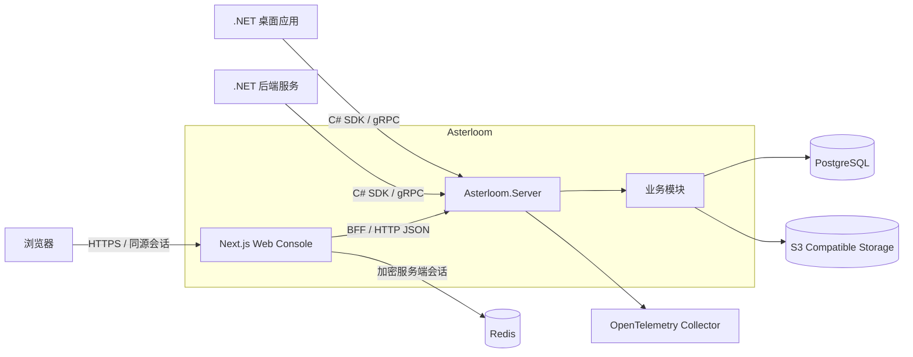
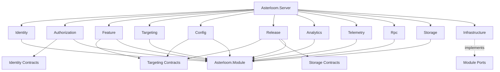

# Asterloom 技术架构与实施基线

> 文档状态：已确认，实施基线  
> 文档版本：0.3  
> 更新日期：2026-08-31
> 适用范围：Asterloom 后端、C# SDK、Web 管理后台、协议、部署与工程质量

## 1. 文档目的

本文档定义 Asterloom 的目标架构、模块边界、协议规范、Web 管理后台范围、数据与安全策略以及实施验收标准。

评审通过后，后续设计和实现必须以本文档为准。若确需偏离，必须先提交 ADR（Architecture Decision Record），说明原因、影响、迁移方案并获得确认，不能在实现中静默改变架构。

本文中的“必须”“不得”表示强制要求；“应”表示默认要求，偏离时必须说明理由。

## 2. 已确认的核心决策

1. 当前只实现 .NET / C# 后端和 C# 公共 SDK，不实现 Rust、Go、C++ SDK 或服务。
2. Web 管理后台使用 React、Next.js App Router 和 TypeScript。
3. Asterloom 自定义 gRPC 业务服务必须启用 gRPC JSON Transcoding，使浏览器能够通过标准 HTTP/JSON 调用同一套业务实现。
4. gRPC 与 HTTP/JSON 不得分别实现两套业务控制器；`.proto` 是业务 API 的唯一契约源。
5. 所有管理类后台 API 必须在 Web 管理后台提供完整操作入口。模块不能以“API 已完成但页面以后再补”的状态交付。
6. Runtime API、事件摄取 API、OIDC/OTLP 等协议端点不要求设计成 CRUD 页面，但必须提供适当的配置、状态、测试或模拟入口，确保其可管理、可验证。
7. Analytics 与 Telemetry 明确分离：
   - Analytics 使用自研事件 SDK，关注产品行为和业务结果。
   - Telemetry 使用 OpenTelemetry，关注日志、指标、Trace、异常和技术健康。
8. 后端首期采用模块化单体：统一宿主、清晰模块边界、独立数据 Schema，并为将来按模块拆分服务保留条件。

### 2.1 当前实现快照

截至 2026-08-30，本文档定义的首期纵向切片已经在当前仓库落地：

| 项目 | 当前状态 |
| --- | --- |
| 后端与 SDK | .NET 10 模块化单体及 C# SDK 已覆盖 Platform、Identity、Authorization、Targeting、Feature、Config、Release、Analytics、Telemetry、Storage 与 RPC/Operations |
| 协议 | 170 个自定义 RPC 均具有 `google.api.http` 映射，可通过原生 gRPC 与 HTTP/JSON 使用，并已生成 OpenAPI 与 Kiota TypeScript Client |
| 管理覆盖 | 163/163 个 Admin RPC 均已绑定 Permission、Web 路由、页面操作标记和 E2E 旅程，覆盖率为 100% |
| Web Console | Passport/BFF、全部管理工作区、Operations API 目录与健康页面均已实现 |
| 自动化验证 | 46 个后端单元测试、9 个集成测试、20 个契约测试、29 个前端测试和 15 条浏览器旅程通过 |
| 构建与安全 | 后端 Release 构建 0 警告/0 错误，Next.js 生产构建通过，当前 NuGet 与 npm 依赖审计无已知漏洞 |

该快照表示代码与自动化验收状态，不等同于任意部署环境已经完成容量评估、备份恢复演练或生产变更审批；这些工作仍按第 18、19 节执行。

## 3. 产品目标与范围

### 3.1 产品目标

Asterloom 为客户端应用和后端服务提供统一的基础平台能力：

| 能力 | 目标 |
| --- | --- |
| Identity | 统一账户、登录、会话和 OAuth 2.0 / OpenID Connect |
| Authorization | 统一角色、权限、策略和访问控制 |
| Feature Flag | 在不发布客户端新版本的情况下控制功能和变体 |
| Targeting / Rollout | 按属性、分群和稳定百分比分桶逐步开放能力 |
| Dynamic Config | 动态发布、回滚和获取类型化配置 |
| Desktop Update | 管理桌面版本、通道、更新包和灰度升级 |
| Analytics | 采集和分析产品事件与业务结果 |
| Telemetry | 采集技术健康、日志、指标、Trace 和诊断信息 |
| RPC / HTTP | 通过同一份契约提供原生 gRPC 和 HTTP/JSON |
| File Storage | 基于 S3 协议存储、下载和管理对象 |
| Persistence | 使用 PostgreSQL 持久化平台数据 |
| Web Console | 完整管理和验证全部平台能力 |

### 3.2 当前范围

- 一个 .NET 服务端实现。
- 一套 C# SDK。
- 一个 TypeScript Web 管理后台。
- PostgreSQL 持久化。
- Redis 服务端 Web BFF 会话存储。
- S3 兼容对象存储。
- gRPC、gRPC JSON Transcoding 和生成的 OpenAPI。
- Docker Compose 本地开发与容器化部署。
- GitHub Actions CI/CD。

### 3.3 当前非目标

- Rust、Go、C++ 的 SDK 或服务端实现。
- 首期拆分为微服务。
- 让 Web 前端直接访问数据库或对象存储凭据。
- 自研 OAuth 2.0、OIDC、遥测协议或 UI 基础组件库。
- 将 Analytics 和 Telemetry 合并成一个含义模糊的事件系统。
- 首期自研完整的日志、指标和 Trace 存储引擎。

## 4. 核心领域术语

为避免各模块使用不同的范围定义，统一采用以下资源层级：

| 术语 | 含义 |
| --- | --- |
| Tenant | 顶层隔离边界，可表示团队、组织或独立客户 |
| Application | 接入 Asterloom 的桌面程序、Web 应用或后端服务 |
| Environment | Application 下的环境，例如 Development、Staging、Production |
| Actor | 发起操作的用户、服务账户或客户端应用 |
| Subject | 被规则或权限系统评估的对象，通常是用户或服务 |
| Management API | 管理资源、策略、发布和平台配置的后台 API |
| Runtime API | SDK 在应用运行期间调用的评估、配置、更新检查和摄取 API |
| Passport | Asterloom 对统一登录和账户能力的产品名称，由 Identity 模块实现 |

除全局身份资源外，业务资源必须明确归属于 Tenant；Feature、Config、Targeting、Release 等运行时资源还必须归属于 Application 和 Environment。

所有作用域都必须从已验证的路由参数或服务端上下文取得，不得信任客户端在普通 JSON 字段中随意声明的租户身份。

## 5. 总体架构

### 5.1 系统上下文



### 5.2 逻辑分层

系统分为以下逻辑层：

1. **契约层**：`Proto/Asterloom` 中的 Protobuf 契约、HTTP 映射和生成的 OpenAPI。
2. **宿主层**：`Asterloom.Server`，负责进程启动、模块装配、中间件、认证、路由和生命周期。
3. **领域模块层**：`Asterloom.Module.*`，负责各能力的用例、领域规则和端口定义。
4. **基础设施层**：PostgreSQL、S3、OpenTelemetry、时钟、ID、事务、迁移和 Outbox 等适配器。
5. **SDK 层**：`Asterloom.Sdk.*`，为 .NET 客户端提供统一调用、缓存、重试和本地行为。
6. **管理体验层**：`Frontend`，通过转码后的 HTTP/JSON API 完成平台管理、测试和运维查看。

### 5.3 控制面与运行面

虽然首期部署在同一服务进程中，API 和代码必须区分控制面与运行面：

- **控制面**：用户、权限、应用、环境、Flag、Segment、配置、发布、存储策略等管理操作。
- **运行面**：Flag 评估、配置拉取、更新检查、Analytics 批量摄取等高频调用。

运行面不得依赖管理页面会话；控制面必须执行更严格的权限检查和审计。二者可以共享领域服务，但应使用不同的 gRPC Service 和权限策略。

## 6. 仓库结构

目标结构如下：

```text
Backend/
  Asterloom.sln
  Directory.Build.props
  Directory.Packages.props

  Asterloom.Server/
  Asterloom.Shared/

  Asterloom.Module/
  Asterloom.Module.Identity/
  Asterloom.Module.Authorization/
  Asterloom.Module.Feature/
  Asterloom.Module.Targeting/
  Asterloom.Module.Config/
  Asterloom.Module.Release/
  Asterloom.Module.Analytics/
  Asterloom.Module.Telemetry/
  Asterloom.Module.Rpc/
  Asterloom.Module.Storage/
  Asterloom.Module.Infrastructure/

  Asterloom.Sdk/
  Asterloom.Sdk.Identity/
  Asterloom.Sdk.Authorization/
  Asterloom.Sdk.Feature/
  Asterloom.Sdk.Targeting/
  Asterloom.Sdk.Config/
  Asterloom.Sdk.Release/
  Asterloom.Sdk.Analytics/
  Asterloom.Sdk.Telemetry/
  Asterloom.Sdk.Rpc/
  Asterloom.Sdk.Storage/

  Tests/
    Asterloom.UnitTests/
    Asterloom.IntegrationTests/
    Asterloom.ContractTests/

Frontend/
  app/
    (auth)/
    (console)/
    api/
  components/
    ui/
    common/
    layout/
  features/
  lib/
    api/
      generated/
    auth/
    swr/
    validation/
  stores/
  public/
  tests/

Proto/
  Asterloom/
    common/v1/
    platform/v1/
    identity/v1/
    authorization/v1/
    feature/v1/
    targeting/v1/
    config/v1/
    release/v1/
    analytics/v1/
    telemetry/v1/
    storage/v1/

Docs/
  Architecture.md
  Protocol/
    openapi/
    admin-api-coverage.yaml
  ADR/

Deploy/
  Scripts/
  OpenTelemetry/

Dockerfile
docker-compose.yml
global.json
```

说明：

- `Asterloom.Module` 是平台内核和模块抽象，拥有 Tenant、Application、Environment 等平台级资源及模块注册契约。
- `Asterloom.Shared` 只保存跨后端与 SDK 真正稳定的基础类型或约定，不得成为业务代码的公共堆放区。
- `Asterloom.Module.Infrastructure` 提供端口实现，不拥有 Feature、Release 等业务规则。
- TypeScript 生成客户端仅供 `Frontend` 内部使用，不属于对外承诺的多语言 SDK。
- 测试工程可以按模块继续细分，但必须保留 Unit、Integration、Contract 和 Web E2E 四类测试边界。

## 7. 模块依赖规则

### 7.1 依赖方向



强制规则：

1. 只有 `Asterloom.Server` 可以直接引用全部模块并完成装配。
2. 业务模块不得引用 `Asterloom.Server`。
3. 业务模块不得直接读取其他模块的数据表或数据库 Schema。
4. 跨模块同步调用必须依赖对方公开的接口契约；跨模块异步协作使用领域事件和 Transactional Outbox。
5. Infrastructure 可以实现业务模块定义的端口，但业务模块不得依赖具体数据库、S3 或遥测供应商。
6. Feature、Config 和 Release 可以依赖 Targeting 契约；Targeting 不得反向依赖这些模块。
7. Authorization 可以依赖 Identity 的主体查询契约；Identity 不得依赖 Casbin 的具体实现。
8. 循环项目引用和通过 Service Locator 绕过依赖规则均被禁止。

### 7.2 模块职责

| 模块 | 主要职责 | 明确不负责 |
| --- | --- | --- |
| Asterloom.Module | 平台资源、模块接口、请求上下文、审计抽象 | 具体数据库和各能力业务规则 |
| Identity | 账户、登录、OIDC/OAuth、会话、客户端和服务账户 | 产品权限策略 |
| Authorization | 角色、权限、策略、授权判定 | 用户密码和令牌签发 |
| Targeting | 属性、Segment、规则匹配、稳定分桶、模拟 | Flag、配置和发布实体 |
| Feature | Flag、变体、生命周期、评估编排、OpenFeature Provider | 通用 Segment 实现 |
| Config | 类型化配置、草稿、发布、版本、回滚、快照 | Secret Manager |
| Release | 应用版本、通道、Manifest、Artifact、灰度更新 | 通用对象存储实现 |
| Analytics | 产品事件 Schema、摄取、聚合和查询 | 日志、Trace 和基础设施指标 |
| Telemetry | OpenTelemetry 配置、采样、导出和技术健康 | 产品行为分析 |
| Rpc | gRPC/HTTP 公共配置、拦截器、错误映射、协议元数据 | 业务用例 |
| Storage | Bucket/Object 管理、上传下载、元数据和访问策略 | Release 业务状态 |
| Infrastructure | Npgsql、S3、迁移、Outbox、加密、时钟等适配器 | 业务策略 |

## 8. 技术栈基线

### 8.1 后端与 SDK

| 范围 | 技术 |
| --- | --- |
| Runtime | .NET 10 LTS、C# |
| Server | ASP.NET Core、Grpc.AspNetCore |
| JSON Transcoding | Microsoft.AspNetCore.Grpc.JsonTranscoding |
| OpenAPI | Microsoft.AspNetCore.Grpc.Swagger + Swashbuckle.AspNetCore + OpenAPI |
| Identity | ASP.NET Core Identity + OpenIddict Server/Client/Validation |
| Authorization | Casbin.NET |
| Feature | OpenFeature .NET SDK + Asterloom Provider |
| Config SDK | HttpClient + System.Text.Json |
| Desktop Update | 自定义 Manifest + Velopack |
| Analytics | 自研 Analytics SDK + HttpClient |
| Telemetry | OpenTelemetry .NET SDK + OTLP |
| RPC Client | Grpc.Net.Client |
| HTTP Client Generation | Kiota；确有不兼容时通过 ADR 改用 OpenAPI Generator |
| Storage | AWSSDK.S3 |
| Persistence | Npgsql；Identity 持久化允许使用 EF Core Npgsql Provider |
| Testing | xUnit、ASP.NET Core TestServer、Testcontainers |

后端必须开启 Nullable Reference Types，并在 CI 中将项目自身的编译警告视为错误。NuGet 版本通过 Central Package Management 集中锁定。

ASP.NET Core Identity 负责用户凭据、账户生命周期和登录会话；OpenIddict 负责 OAuth 2.0 / OpenID Connect 协议和令牌。不得将 OpenIddict 误当作完整用户管理系统。

Identity 模块允许使用 OpenIddict/ASP.NET Core Identity 官方 EF Core Store 与 Npgsql Provider，以降低自定义授权服务器存储实现的安全风险。其他模块默认直接通过 Npgsql 和显式 Repository/SQL 访问数据；如需引入额外 ORM，必须提交 ADR。

### 8.2 Web 前端

| 范围 | 技术 |
| --- | --- |
| Framework | React + Next.js App Router + TypeScript |
| Styling | Tailwind CSS 4 |
| UI | shadcn-ui + Radix UI |
| Icons / Font | Lucide + Geist |
| Notifications | Sonner |
| Command/Search | cmdk |
| Server State | SWR |
| UI State | Zustand |
| Validation | Zod |
| Generated API Client | Kiota TypeScript Client |
| BFF Session | Redis + node-redis；载荷使用 AES-256-GCM 加密 |
| Token Validation | jose + OIDC JWKS |
| Component Tests | Vitest + Testing Library |
| E2E | Playwright |

依赖版本必须由锁文件固定。不得依赖 `latest` 标签完成可重复构建。

## 9. Identity 与 Authorization

### 9.1 身份流程

支持以下标准流程：

- 用户交互登录：Authorization Code Flow + PKCE。
- 桌面客户端：系统浏览器 + Authorization Code Flow + PKCE；回调使用经过注册的 Loopback URI 或自定义 URI。
- 服务到服务：Client Credentials Flow。
- Refresh Token：仅向允许离线访问且满足安全策略的客户端签发，并启用轮换和重用检测。

不得为新客户端启用 Implicit Flow 或 Resource Owner Password Credentials Flow。

签名密钥、加密密钥和 ASP.NET Core Data Protection Key Ring 必须持久化到容器外，并支持轮换。Issuer 在同一环境中必须稳定，不能随容器主机名变化。

### 9.2 Web 管理后台会话

Web Console 使用 BFF/同源会话模式：

1. 浏览器访问 Next.js。
2. 登录通过 Passport 的 OIDC Authorization Code + PKCE 完成。
3. Token 或服务端会话材料仅存在于服务端；浏览器只持有随机、不透明、`HttpOnly`、`Secure`、合理 `SameSite` 的会话 Cookie。
4. 浏览器调用 Next.js Route Handler。
5. Route Handler 将请求转发到 Asterloom.Server 的 JSON Transcoding API。

不得把 Access Token 或 Refresh Token 持久化到 Local Storage、Session Storage 或可由客户端 JavaScript 读取的 Cookie。

Next.js BFF 只负责会话、转发、CSRF 防护和少量前端聚合，不承载领域规则，也不得直接访问 Asterloom 数据库。

生产环境的 BFF 会话和短期 OIDC 事务存放在独立 Redis 中，Redis Key 不使用原始 Cookie 值，Token 载荷还必须使用独立密钥加密。进程内存储仅用于开发和测试。具体决策见 `Docs/ADR/0001-redis-for-web-bff-sessions.md`。

### 9.3 授权模型

授权默认拒绝，服务端是唯一可信判定方。前端隐藏按钮只属于用户体验优化，不能替代 API 授权。

权限命名统一为：

```text
<module>.<resource>.<action>
```

示例：

- `identity.user.read`
- `identity.user.suspend`
- `feature.flag.publish`
- `release.release.promote`
- `storage.object.delete`

Casbin 请求至少包含：

```text
subject, tenant, application/environment scope, resource, action
```

平台预置角色建议为 Super Administrator、Tenant Administrator、Operator、Developer 和 Viewer。角色只是权限集合，最终判定仍由权限策略完成。

所有管理写操作必须记录审计日志，包括 Actor、Tenant、作用域、操作、资源、请求 ID、时间、结果以及脱敏后的变更摘要。

## 10. gRPC、JSON Transcoding 与 OpenAPI

### 10.1 契约唯一来源

`Proto/Asterloom` 是 API 的唯一契约源。每个服务应按模块和主版本拆分：

```text
package asterloom.feature.v1;
package asterloom.feature.admin.v1;
```

- Runtime Service 与 Admin Service 必须分开定义。
- Protobuf Package 和 HTTP 路径都必须包含主版本。
- 已发布字段编号不得复用。
- 删除字段时保留其编号和名称。
- 注释必须足够生成可读的 OpenAPI 文档。

### 10.2 JSON Transcoding 强制要求

所有 Asterloom 自定义 gRPC 业务 RPC 必须：

1. 使用 `google.api.http` 声明 HTTP Verb 和路径。
2. 通过 `AddJsonTranscoding()` 注册。
3. 同时通过原生 gRPC 和 HTTP/JSON Contract Test。
4. 共享同一认证、授权、校验、领域服务和审计逻辑。
5. 出现在生成的 OpenAPI 文档中。

示例：

```proto
syntax = "proto3";

package asterloom.feature.admin.v1;
option csharp_namespace = "Asterloom.Proto.Feature.Admin.V1";

import "google/api/annotations.proto";

service FeatureAdminService {
  // Lists feature flags in an environment.
  rpc ListFlags(ListFlagsRequest) returns (ListFlagsResponse) {
    option (google.api.http) = {
      get: "/api/v1/tenants/{tenant_id}/applications/{application_id}/environments/{environment_id}/flags"
    };
  }

  // Creates a feature flag draft.
  rpc CreateFlag(CreateFlagRequest) returns (Flag) {
    option (google.api.http) = {
      post: "/api/v1/tenants/{tenant_id}/applications/{application_id}/environments/{environment_id}/flags"
      body: "flag"
    };
  }
}
```

服务端基础配置：

```csharp
builder.Services
    .AddGrpc()
    .AddJsonTranscoding();

builder.Services.AddGrpcSwagger();
builder.Services.AddSwaggerGen();
```

承载 Protobuf 的项目必须启用 HTTP Rule Proto：

```xml
<PropertyGroup>
  <IncludeHttpRuleProtos>true</IncludeHttpRuleProtos>
</PropertyGroup>

<ItemGroup>
  <PackageReference Include="Microsoft.AspNetCore.Grpc.JsonTranscoding" />
  <PackageReference Include="Microsoft.AspNetCore.Grpc.Swagger" />
  <PackageReference Include="Swashbuckle.AspNetCore" />
</ItemGroup>
```

CI 必须检查所有自定义 RPC 是否存在 HTTP Annotation。缺失 Annotation 视为构建失败，而不是仅失去一个可选访问方式。

OIDC、OTLP、健康检查、对象直传和平台要求的标准协议端点可以使用其标准路由，不强行包装为业务 gRPC Service，但必须记录在协议文档中。

管理 API 默认设计为 Unary RPC，并使用分页或轮询满足 Web 场景。流式 RPC 即使可以转码，也必须单独验证浏览器、反向代理、超时和 JSON 流格式；不得把浏览器关键管理能力设计成只能通过原生 gRPC Streaming 使用。大文件不经 Protobuf JSON Base64 上传，统一采用 Storage Upload Session 和预签名 URL。

### 10.3 HTTP 资源规范

- 基础前缀：`/api/v1`。
- 资源使用复数名词和小写路径。
- Tenant、Application、Environment 等作用域放在路径中。
- GET 只读且无副作用。
- Create 使用 POST；全量替换使用 PUT；部分更新使用 PATCH + `FieldMask`；删除使用 DELETE。
- Action 无法自然表达为资源修改时使用 `:publish`、`:rollback`、`:evaluate`、`:revoke` 等显式动作。
- 时间使用 `google.protobuf.Timestamp`。
- 持续时间使用 `google.protobuf.Duration`。
- ID 使用服务端生成的 UUID，并在 JSON 中表现为不透明字符串。
- 枚举必须包含 `*_UNSPECIFIED = 0`。
- 金额、比例和大整数不得依赖 JavaScript 浮点精度；必要时使用字符串或明确的整数刻度。

列表接口统一使用：

```proto
int32 page_size = 1;
string page_token = 2;
```

响应统一返回 `next_page_token`。分页 Token 必须不透明，客户端不得解析。

### 10.4 错误、并发与幂等

- 使用标准 gRPC Status Code，并提供稳定的业务错误码。
- JSON 错误响应必须包含可编程识别的 `code`、用户安全的 `message`、`requestId` 和可选字段级错误。
- 不向客户端返回堆栈、SQL、密钥或内部主机信息。
- 创建、发布、回滚、上传完成等可重试写操作必须支持 `request_id` 或 Idempotency Key。
- 可并发编辑资源使用 `etag` 或版本号；不允许静默覆盖更新。
- 所有入口统一传播 Correlation ID / Trace ID。

### 10.5 OpenAPI 与生成客户端

构建流程从 gRPC JSON Transcoding 端点生成 OpenAPI：

```text
.proto
  ├─> C# gRPC Server / Client
  ├─> JSON Transcoding Routes
  └─> OpenAPI
        └─> Frontend/lib/api/generated
```

要求：

- OpenAPI 文件输出到 `Docs/Protocol/openapi`。
- Frontend 的 API Client 和 DTO 必须生成，不得手写重复 DTO。
- 生成代码不得直接手改；变化必须回到 `.proto`。
- CI 重新生成后必须保证 Git 工作区无差异，以发现忘记提交的生成物。
- OpenAPI 文档在开发环境可通过 Swagger UI 查看；生产环境必须关闭或受管理员权限保护。

## 11. Targeting 与稳定 Bucketing

Targeting 是 Feature、Config 和 Release 的公共判定引擎，必须避免三个模块分别实现规则。

### 11.1 Evaluation Context

公共评估上下文至少包含：

- `targetingKey`：稳定且必填的主体键。
- `userId`：可选账户 ID。
- `applicationId` 和 `environmentId`。
- 客户端版本、平台、区域和语言。
- 经过允许的自定义属性。

不得默认把邮件、姓名、设备原始标识等 PII 放入规则上下文或日志。

### 11.2 规则模型

规则按优先级顺序执行：

1. 显式关闭或归档。
2. 前置条件。
3. Segment/属性规则。
4. 百分比分配。
5. 默认值。

规则必须支持短路、明确的缺失属性语义和类型校验。所有评估结果返回 reason、matchedRuleId、variant/version 和可传播的元数据，便于调试和 Analytics 关联。

### 11.3 Bucketing v1

首版确定性算法：

```text
material = UTF8(
  "v1" + NUL +
  namespace + NUL +
  salt + NUL +
  targetingKey
)

hash   = SHA-256(material)
value  = hash 前 8 字节按无符号大端 UInt64 读取
bucket = value mod 100000
```

百分比统一使用十万分刻度 `0..100000`，例如 12.5% 对应 12500。Variant 区间采用左闭右开 `[start, end)`。

`namespace` 必须包含资源类型、资源 Key 和环境，避免不同 Flag、Config 或 Release 意外共享桶。`salt` 创建后默认稳定；重新随机化必须作为显式管理操作并记录审计。

必须维护固定 Golden Test Vectors，并由服务端与 C# SDK 共同验证。Web 模拟器调用服务端评估 API，不在 TypeScript 中复制一套独立 Bucketing 实现。

## 12. 各业务模块设计

### 12.1 Platform Kernel

负责 Tenant、Application、Environment、成员关系、平台设置、请求上下文和审计契约。

资源删除默认采用可恢复的生命周期状态。Production Environment 的删除、密钥轮换和数据清理属于高风险操作，必须二次确认并记录审计。

### 12.2 Identity

主要资源：

- User、Credential、External Login。
- OIDC Client、Scope、Consent。
- Session、Token、Authorization。
- Service Account 和凭据。
- Invitation、Account Status。

用户管理和 OIDC Client 管理是不同概念。Application 也不等于 OIDC Client：一个 Application 可以拥有桌面客户端、Web Console、后台服务等多个 OIDC Client。

### 12.3 Authorization

主要资源：

- Permission Catalog。
- Role。
- Role Binding。
- Policy Rule。
- Policy Revision。

权限目录由代码和模块清单声明，角色与绑定由管理端配置。管理页面必须提供授权模拟器，输入 Actor、作用域、资源和 Action，显示最终结果及匹配策略，但不得暴露敏感内部信息。

### 12.4 Feature

主要资源：

- Feature Flag。
- Variant。
- Draft Revision。
- Published Revision。
- Prerequisite。

运行时评估必须实现 OpenFeature Provider。SDK 应支持默认值、缓存、超时、错误回退和 Evaluation Details。

Production 修改采用 Draft → Validate → Publish 流程。已发布版本不可原地修改；回滚创建新的发布版本。

### 12.5 Config

配置值支持 Boolean、Integer、Double、String、JSON 等明确类型，并可附带 Schema、默认值和描述。

配置发布采用不可变 Snapshot，客户端按 Snapshot Version 拉取。支持 ETag/条件请求、本地 Last-Known-Good 缓存和回滚。

Config 不是 Secret Manager。默认不得把数据库密码、私钥、云凭据等秘密配置下发给桌面或浏览器客户端。需要服务端可见配置时必须显式标记可见范围并执行权限检查和响应脱敏。

### 12.6 Release

主要资源：

- Product/Application。
- Channel。
- Release。
- Artifact。
- Update Manifest。
- Rollout Policy。

更新包存入 S3，元数据和发布状态存入 PostgreSQL。发布流程为：

```text
上传 Artifact
  -> 校验哈希/签名
  -> 创建 Draft Release
  -> 生成 Manifest
  -> 发布到 Channel
  -> Targeting 灰度
  -> Promote / Pause / Rollback
```

客户端更新检查返回匹配版本、Manifest、下载地址、哈希、签名和回退原因。更新包必须签名；仅通过 HTTPS 和哈希不足以替代发布签名。

Velopack 负责 .NET 桌面端实际下载和安装，Asterloom 负责发布控制、Manifest、Artifact 与灰度资格。

### 12.7 Analytics

Analytics SDK 负责：

- 类型化事件或受控自由事件。
- 公共上下文。
- 批量、压缩、重试和离线队列。
- Event ID 幂等去重。
- Flush 和进程退出时的有界等待。

服务端负责事件 Schema、写入 Key、摄取、校验、脱敏、保留策略、聚合和查询。

首期 Analytics 元数据和可控规模的事件数据使用 PostgreSQL 分区表；原始大 Payload 可转存 S3。若容量测试证明 PostgreSQL 不满足吞吐或分析延迟，再通过 ADR 引入专用分析存储，不在业务层硬编码数据库特性。

### 12.8 Telemetry

Telemetry 使用 OpenTelemetry .NET SDK 和 OTLP，不自研第二套 Trace/Metric/Log 协议。

`Asterloom.Sdk.Telemetry` 提供统一 Resource 属性、Service Name、环境、Trace 传播、默认 Instrumentation 和 Exporter 配置。`Asterloom.Module.Telemetry` 提供平台侧配置、采样、来源登记、Collector 健康和诊断入口。

OpenTelemetry Collector 是部署组件，负责接收、处理和转发。首期不在 PostgreSQL 中自研存储完整 Metrics、Logs 和 Traces；实际观测后端作为可替换部署依赖。Web Console 至少提供：

- Telemetry Source 与环境配置。
- 采样和导出设置。
- Collector/Exporter 健康状态。
- 最近错误和关联 Trace ID。
- 到实际观测后端的受控跳转或查询代理。

### 12.9 Storage

Storage 提供：

- Bucket/Namespace 管理。
- Object 列表、元数据、上传、下载、复制和删除。
- 短时效预签名 URL。
- Content Type、大小、哈希和自定义元数据。
- 配额、访问策略和审计。

大文件优先通过预签名 URL 直传 S3，业务 API 负责创建 Upload Session 和确认完成。服务端不得把长期 S3 Credential 下发给客户端。

### 12.10 RPC

Rpc 模块提供所有服务共享的：

- gRPC、JSON Transcoding 和 OpenAPI 注册。
- Authentication/Authorization Interceptor。
- Correlation、Tracing、Metrics 和结构化日志。
- Validation、Exception/Status 映射。
- Deadline、Cancellation 和请求大小限制。
- API Metadata、版本和健康信息。

Operations Web 页面提供 API 目录、OpenAPI 下载及依赖健康。平台版本由 Platform Info 契约提供；Feature、Config、Targeting、Release 等运行面测试由各领域页面的模拟器完成。Operations 不提供可输入任意 URL 或任意 Payload 的通用请求代理，避免绕过领域校验、扩大 SSRF 面或制造第二套权限边界。

Rpc 模块不得包含 Flag、User 或 Release 等领域用例。

## 13. Web 管理后台

### 13.1 前端分层

- `app`：路由、Layout、Loading、Error Boundary 和 Route Handler。
- `features`：按领域模块组织页面逻辑、表单和视图模型。
- `components/ui`：shadcn-ui 生成的基础组件。
- `components/common`：表格、筛选器、资源选择器、确认框、权限门等共享组件。
- `lib/api/generated`：从 OpenAPI 生成的客户端，不手工修改。
- `lib/auth`：BFF 会话、CSRF 和当前 Actor。
- `lib/swr`：统一 Key、Fetcher、错误映射和 Mutation 帮助函数。
- `stores`：只保存导航、面板、草稿 UI 等本地状态。

SWR 是服务端状态的唯一客户端缓存。不得把 User 列表、Flag、配置等服务端资源复制到 Zustand 中形成第二真相源。

Zod 用于表单、URL 参数、本地存储和不可信响应边界的运行时校验。生成 DTO 负责协议类型，Zod 不得演化成另一套手写后端模型。

### 13.2 UI 体验基线

所有管理资源页面必须处理：

- Loading、Empty、Error、Forbidden 和 Not Found。
- 搜索、筛选、排序和分页。
- Create、Read、Update、Delete/Archive。
- 成功与失败 Toast。
- 危险操作确认。
- 并发冲突提示和重新加载。
- 权限不足时的解释。
- 审计入口。
- 键盘操作、焦点管理和基本可访问性。

桌面优先，但登录、审批和只读查看应支持常见移动宽度。Geist 通过 Next.js Font 方案加载；主题 Token 通过 Tailwind CSS 4 和 CSS Variables 统一，不在页面中散落硬编码颜色。

Sonner 用于异步操作反馈；cmdk 用于全局命令面板、资源跳转和大型可搜索选择器；Lucide 是唯一默认图标来源。

### 13.3 页面与能力覆盖

| 模块 | 建议路由 | 必须具备的管理操作 |
| --- | --- | --- |
| Platform | `/tenants`、`/applications`、`/environments` | 增删改查、切换上下文、环境保护、成员关系 |
| Identity | `/identity/users`、`/identity/clients`、`/identity/sessions` | 用户、邀请、禁用、Client/Scope、凭据轮换、会话撤销 |
| Authorization | `/authorization/roles`、`/authorization/policies`、`/authorization/simulator` | 角色、绑定、策略、版本、授权模拟 |
| Feature | `/features`、`/features/[key]` | Flag/Variant、规则、草稿、校验、发布、回滚、评估 |
| Targeting | `/targeting/segments`、`/targeting/simulator` | Segment、规则、属性、分桶预览、匹配模拟 |
| Config | `/config`、`/config/[key]` | 类型/Schema、草稿、Diff、发布、历史、回滚、有效值预览 |
| Release | `/releases`、`/channels`、`/artifacts` | 上传、签名状态、Manifest、通道、灰度、暂停、晋级、回滚、更新模拟 |
| Analytics | `/analytics/schemas`、`/analytics/explorer` | Event Schema、写入 Key、事件浏览、聚合、保留和导出 |
| Telemetry | `/telemetry/sources`、`/telemetry/health` | 来源、采样、Exporter、Collector 健康、诊断跳转 |
| Storage | `/storage/buckets`、`/storage/objects` | Bucket、对象浏览、上传、下载、删除、元数据、预签名链接 |
| RPC / Operations | `/operations/apis`、`/operations/health` | API 目录、OpenAPI、依赖健康；版本来自 Platform Info，受控测试调用位于对应领域页面 |
| Audit | `/audit` | 搜索、筛选、详情、关联请求和导出 |

页面可以调整信息架构，但表中的能力不能缺失。

### 13.4 API/UI 100% 覆盖机制

仓库必须维护 `Docs/Protocol/admin-api-coverage.yaml`，每个 RPC 一条记录：

```yaml
apis:
  - service: asterloom.feature.admin.v1.FeatureAdminService
    rpc: CreateFlag
    category: admin
    http: POST /api/v1/tenants/{tenant_id}/applications/{application_id}/environments/{environment_id}/flags
    permission: feature.flag.create
    uiRoute: /features/new
    uiAction: create-feature-flag
    e2eTest: feature/create-flag.spec.ts
```

CI 从 Protobuf Descriptor Set 提取 RPC，并验证：

- 每个 RPC 都有 HTTP 映射。
- 每个 Admin RPC 都有 Permission、UI Route、UI Action 和 E2E Test。
- 每个 Runtime RPC 都有 SDK 测试以及管理端测试器、状态页或明确的 `notApplicableReason`。
- Coverage 为 100%，否则构建失败。

新增管理 API 的 PR 必须在同一个垂直切片中交付协议、后端、生成客户端、页面操作、权限、审计和 E2E。禁止先合并不可操作的 Admin API。

## 14. C# SDK

### 14.1 公共约定

`Asterloom.Sdk` 提供：

- Endpoint、Tenant/Application/Environment 和认证配置。
- HttpClient/gRPC Channel 生命周期管理。
- Deadline、CancellationToken、重试与退避。
- 统一异常与 Result 映射。
- User-Agent/SDK Version。
- Correlation 和 OpenTelemetry Context 传播。
- 可测试的 Clock、存储和网络抽象。

各能力 SDK 只公开领域友好 API，不向使用方泄漏生成 Stub 的不稳定细节。

### 14.2 模块 SDK

- Identity：交互登录、Token 生命周期、登出和服务凭据。
- Authorization：权限检查和可选短时缓存；敏感操作仍由服务端复核。
- Feature：OpenFeature Provider、评估详情和 Last-Known-Good。
- Targeting：公共上下文、规则类型和 Bucketing Golden Vectors。
- Config：类型化读取、快照缓存、ETag 和更新通知。
- Release：更新检查、Manifest 验证和 Velopack 适配。
- Analytics：批量、离线队列、重试、Flush 和隐私设置。
- Telemetry：OpenTelemetry 默认配置和 Exporter 集成。
- Rpc：Channel、Interceptor 和错误约定。
- Storage：对象元数据、预签名上传下载和流式辅助。

默认重试只适用于幂等操作。SDK 不得自动重试非幂等写请求，除非请求带有服务端支持的幂等键。

## 15. 数据与持久化

### 15.1 PostgreSQL

首期使用一个 PostgreSQL 实例/数据库，模块使用独立 Schema：

```text
platform
identity
authorization
targeting
feature
config
release
analytics
telemetry
storage
infrastructure
```

规则：

- 表、索引和约束归属单一模块。
- 跨 Schema 外键原则上禁止；跨模块一致性通过稳定 ID、服务契约和事件维护。
- 所有 Tenant 数据必须包含 Tenant ID，并建立与查询模式匹配的复合索引。
- 乐观并发使用 Version/ETag。
- 时间以 UTC 保存。
- 数据库迁移按模块编号，部署时显式执行。
- 服务启动不得自动执行不可逆生产迁移。
- 向后兼容迁移遵循 Expand → Migrate → Contract。

### 15.2 Transactional Outbox

需要跨模块传播的事件与业务写入在同一数据库事务中写入 Outbox。后台 Dispatcher 负责投递、重试和去重。

消费者必须幂等。Outbox 管理页面默认只读展示积压、失败和重试次数；手工重放属于高权限操作并必须审计。

### 15.3 S3

S3 存放：

- Release Artifact 和 Manifest 相关对象。
- 普通文件对象。
- 大型 Analytics 原始归档。
- 可选导出文件。

数据库保存业务元数据、对象 Key、版本、大小、哈希、Content Type 和状态，不把大型二进制直接存入 PostgreSQL。

本地开发使用 S3 兼容服务；生产可以使用 AWS S3 或兼容实现。代码只依赖 S3 能力的已验证子集。

## 16. 安全基线

- 所有生产流量使用 TLS。
- 所有管理 API 要求认证、Tenant Scope 和明确 Permission。
- 所有输入在服务端校验；Zod 不是服务端安全边界。
- Mutation 需要 CSRF 防护；OIDC 流程校验 State、Nonce 和 PKCE。
- 登录、Token、Analytics 摄取、对象上传和高成本查询必须限流。
- Passport 登录默认按来源 IP 每分钟允许 10 次提交；可通过 `Identity:RateLimiting:LoginPermitLimit` 在 1-10,000 范围内配置。生产环境提高该值前必须完成安全与容量评审，E2E 内存部署可使用 100 以容纳并行独立会话。
- 密钥通过部署 Secret 注入，不写入仓库、镜像或普通配置表。
- 日志和审计对 Token、密码、Cookie、连接串和 PII 脱敏。
- 数据下载和预签名 URL 使用短有效期和最小权限。
- Release Artifact 必须校验哈希和签名。
- 依赖使用锁文件和自动漏洞扫描。
- Production 高风险操作要求重新认证或二次确认。
- 服务端权限检查不得根据前端传入的角色名称直接放行。

## 17. 可观测性与审计

每个服务请求至少生成：

- Trace/Span。
- 请求数量、延迟、错误率。
- gRPC Method 与 HTTP Route 等低基数维度。
- Correlation/Trace ID。
- 结构化日志。

禁止把 User ID、Flag Key 等高基数值默认作为 Metric Label；它们可以出现在受控日志或 Trace Attribute 中。

关键业务指标包括：

- Identity 登录成功率和 Token 失败原因。
- Authorization Deny 数量。
- Feature/Config/Release 评估延迟和缓存命中率。
- Analytics 接收、拒绝、去重和积压。
- Storage 上传失败和校验失败。
- Outbox 积压与重试。

审计日志与普通应用日志分开建模。审计记录必须不可由普通管理员修改，敏感字段只记录摘要或脱敏差异。

## 18. 测试与验收

### 18.1 测试层次

| 类型 | 目标 |
| --- | --- |
| Unit | 领域规则、权限映射、Bucketing、序列化和 SDK 行为 |
| Integration | PostgreSQL、OpenIddict、Casbin、S3、Outbox 和模块装配 |
| Contract | 原生 gRPC 与 JSON Transcoding 的等价性、OpenAPI 和向后兼容 |
| SDK | 超时、取消、重试、缓存、离线和 Token 生命周期 |
| Frontend Component | 表单、校验、权限状态和错误状态 |
| E2E | 从 Web 登录到每个 Admin API 操作的完整路径 |
| Security | 越权、Tenant 穿透、CSRF、Token 重放、上传和信息泄漏 |
| Performance | Runtime 评估、事件摄取、配置拉取和更新检查 |

标准 Playwright 旅程固定使用 4 个 worker。该上限用于让共享内存型测试部署保持确定性；压力与容量测试必须使用独立环境、PostgreSQL/Redis/S3 实际适配器和专用负载工具，不能通过无上限增加管理 E2E worker 代替。

### 18.2 模块完成定义

一个管理能力只有同时满足以下条件才算完成：

1. Protobuf 契约和 HTTP Annotation 已提交。
2. 原生 gRPC 与 JSON API 调用同一用例实现。
3. 权限、作用域、校验、幂等和审计已完成。
4. PostgreSQL/S3 迁移或适配器已完成。
5. C# SDK 或 Runtime 调用方已完成。
6. OpenAPI 和 TypeScript Client 已重新生成。
7. Web 页面可以完成该 API 的全部管理动作。
8. Loading、Empty、Error、Forbidden 和并发冲突状态已处理。
9. Integration、Contract 和 E2E 测试通过。
10. `admin-api-coverage.yaml` 覆盖率保持 100%。

“后端完成、页面待办”不符合完成定义。

## 19. 构建、CI/CD 与部署

### 19.1 CI

GitHub Actions 至少包含：

1. `dotnet restore/build/test`。
2. Protobuf 编译和 Breaking Change 检查。
3. JSON Transcoding Annotation 检查。
4. OpenAPI 和生成客户端一致性检查。
5. Frontend lint、typecheck、test 和 build。
6. Playwright E2E。
7. Docker Image 构建。
8. 依赖和容器漏洞扫描。
9. API/UI Coverage 100% 检查。

### 19.2 容器

建议构建两个生产镜像：

- `asterloom-server`：ASP.NET Core Server 和全部后端模块。
- `asterloom-web`：Next.js Web Console/BFF。

`docker-compose.yml` 的本地依赖至少包括：

- Server。
- Web。
- PostgreSQL。
- Redis（Web BFF 服务端会话）。
- S3 兼容对象存储。
- OpenTelemetry Collector。
- 可选的本地观测后端。

### 19.3 网络入口

生产推荐：

```text
Browser
  -> Web Console / BFF
      -> JSON Transcoding API

.NET SDK / Services
  -> Native gRPC API

Telemetry SDK
  -> OTLP Collector
```

Web Console 与 API 之间使用内部网络。生产环境原则上不需要允许浏览器跨域直连后端；确需开放给第三方浏览器客户端时，CORS 必须使用明确 Origin 白名单，不得使用带凭据的通配配置。

服务必须提供 Liveness、Readiness 和 Startup Probe。Readiness 检查关键依赖，但避免因非关键观测后端短暂不可用而让整个业务服务下线。

## 20. 实施顺序与当前状态

实施采用纵向切片，确保每一阶段都有可操作 Web UI：

当前第 1-9 阶段均已满足第 18.2 节的代码完成定义；第 10 阶段是随部署环境持续进行的生产强化工作。

1. **工程基础**：解决方案、项目骨架、Proto 编译、模块系统、统一错误、数据库迁移、CI。
2. **Platform + Identity**：Tenant/Application/Environment、用户、OIDC、Web 登录和会话。
3. **Authorization**：权限目录、角色、绑定、Casbin Enforcement、前端权限体验、审计。
4. **RPC Contract Pipeline**：JSON Transcoding、OpenAPI、Kiota、Coverage 检查和 API 目录。
5. **Targeting + Feature**：规则、Bucketing、OpenFeature Provider、模拟器和完整 Web 管理。
6. **Config**：类型、版本、发布、缓存、回滚和 Web Diff。
7. **Storage + Release**：S3、Artifact、Manifest、签名、Velopack、灰度发布。
8. **Analytics**：SDK 队列、批量摄取、Schema、查询和管理页面。
9. **Telemetry**：OTel SDK、Collector、健康和诊断入口。
10. **强化**：性能、安全测试、备份恢复、升级和生产部署。

每一步都必须满足第 18.2 节的完成定义，不能先横向实现全部后端后再集中补前端。

## 21. 架构约束摘要

后续实现必须始终满足：

- 只实现 C# 公共 SDK；TypeScript 仅用于 Web 管理后台。
- 单一 `.proto` 契约，同时支持 gRPC 和 HTTP/JSON。
- 所有自定义业务 RPC 开启 JSON Transcoding 并生成 OpenAPI。
- Web 不直接访问数据库，也不保存可由 JavaScript 读取的 Token。
- Admin API 与 Web 操作覆盖率为 100%。
- Feature、Config、Release 共享 Targeting 和 Bucketing。
- Analytics 与 Telemetry 分离。
- 模块不跨 Schema 读取数据。
- Infrastructure 不包含领域规则。
- 所有管理写操作执行权限检查、并发控制和审计。
- 未通过 Contract、Integration 和 E2E 的能力不算完成。

## 22. 参考资料

- [Microsoft：.NET 官方支持策略](https://dotnet.microsoft.com/en-us/platform/support/policy)
- [Microsoft：ASP.NET Core gRPC JSON Transcoding](https://learn.microsoft.com/en-us/aspnet/core/grpc/json-transcoding?view=aspnetcore-10.0)
- [Microsoft：浏览器中的 gRPC 方案](https://learn.microsoft.com/en-us/aspnet/core/grpc/browser?view=aspnetcore-10.0)
- [Microsoft：为 JSON Transcoding 生成 OpenAPI](https://learn.microsoft.com/en-us/aspnet/core/grpc/json-transcoding-openapi?view=aspnetcore-10.0)
- [OpenIddict：选择 OAuth 2.0 / OIDC Flow](https://documentation.openiddict.com/guides/choosing-the-right-flow.html)
- [OpenIddict：创建 Server Instance](https://documentation.openiddict.com/guides/getting-started/creating-your-own-server-instance)
- [Next.js：Backend for Frontend](https://nextjs.org/docs/app/guides/backend-for-frontend)
- [Next.js：App Router](https://nextjs.org/docs/app/getting-started)
